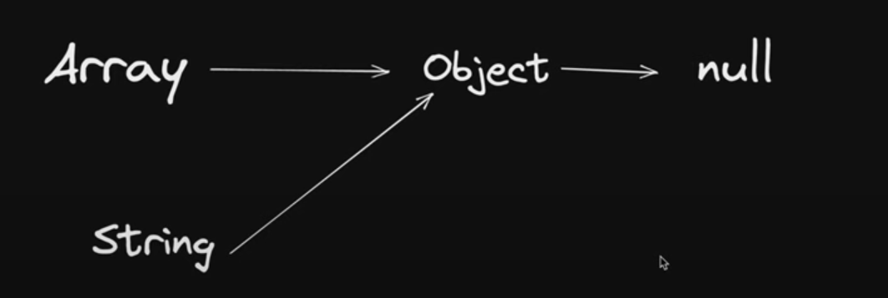

# In programming, inheritance refers to passing down characteristics from a parent to a child so that a new piece of code can reuse and build upon the features of an existing one. JavaScript implements inheritance by using objects. Each object has an internal link to another object called its prototype. That prototype object has a prototype of its own, and so on until an object is reached with null as its prototype. By definition, null has no prototype and acts as the final link in this prototype chain. It is possible to mutate any member of the prototype chain or even swap out the prototype at runtime, so concepts like static dispatching do not exist in JavaScript

// this for prototype chaining 
# `https://developer.mozilla.org/en-US/docs/Web/JavaScript/Guide/Inheritance_and_the_prototype_chain`

/*

Here's what happens behind the scenes when the new keyword is used:

A new object is created: The new keyword initiates the creation of a new JavaScript object.

A prototype is linked: The newly created object gets linked to the prototype property of the constructor function. This means that it has access to properties and methods defined on the constructor's prototype.

The constructor is called: The constructor function is called with the specified arguments and this is bound to the newly created object. If no explicit return value is specified from the constructor, JavaScript assumes this, the newly created object, to be the intended return value.

The new object is returned: After the constructor function has been called, if it doesn't return a non-primitive value (object, array, function, etc.), the newly created object is returned.

*/